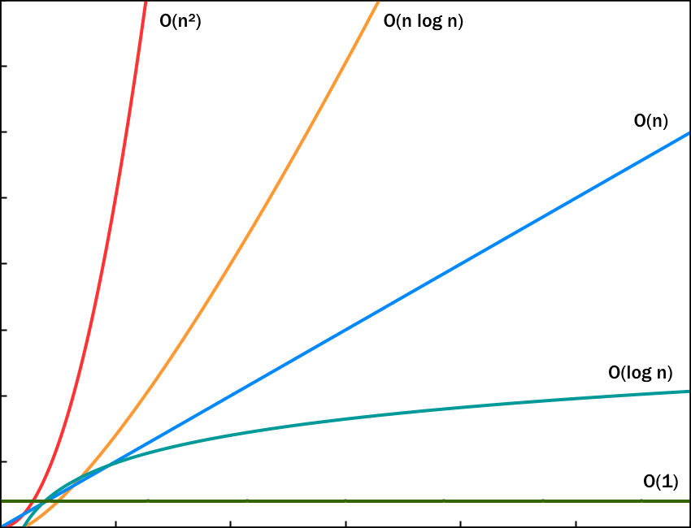

<h2>de facut:</h2>
<ul>
    <li>indicatorul lui euler</li>
    <li>suma divizori cu factori primi</li>
    <li>ridicarea la putere logaritmica (infoarena 12)</li>
    <li>imultirea a la russe</li>
    <li>rmq (infoarena 16)</li>
    <li>deque (infoarena 24)</li>
    <li>principiul includerii si scaderii (infoarena 43)</li>
    <li>element majoritar (informare 57)</li>
    <li>programare dinamica</li>
 </ul>

<h2>de revizuit:</h2>
<ul>
    <li>secvente de suma maxima (infoarenta 35)</li>
    <li>cautare binara (infoarena 18)</li>
    <li>metoda greedy</li>
    <li>secvente</li>
    <li>interclasare</li>
    <li>suma si numarul divizori (infoarena 48)</li>
    <li>vectori de frecventa si caracteristici</li>
    <li>operatii pe biti</li>
</ul>

